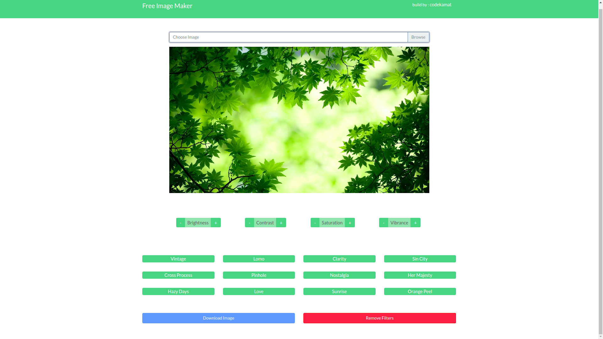

# FreeImageMaker
#### See Live Site: <https://freeimagemaker.netlify.app/>

### Description:
- upload image 
- change filter
- add effects
- remove filters
- download new edited image

### Image Editor using CamanJS

**CamanJS** is used for doing <ins>(ca)nvas</ins> <ins>(man)ipulation</ins> in <ins>JavaScript(JS)</ins>. It is very easy to extend with new filters and plugins, and it comes with a wide array of image editing functionality, which continues to grow. It's completely library independent and works both in NodeJS and the browser.

#### Tech Stack-

- HTML CSS
- Vanilla Javascript
- Bootstrap4
- CamanJS API

#### Screens :computer:

